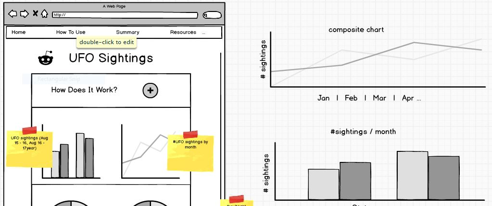
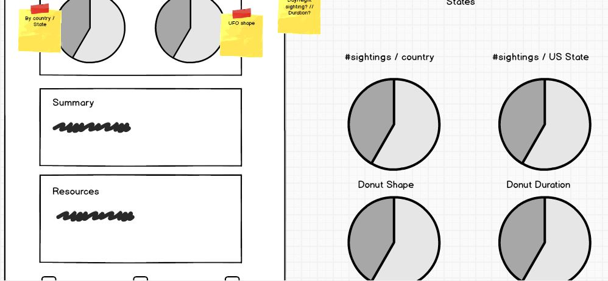

# UFO sightings worldwide between the dates of 25/8/2016 - 24/8/2017

The data dashboard displays five separate charts which present accumulated data concerning UFO activity spanning an entire year (until present records permit.)

It is designed to relay and visually present general behavioural patterns, shapes, frequency and locale of UFO sightings in a bite-sized and easily digestible format, as opposed to the reams of data presented in the source excel file.

## UX

This site is for UFO enthusiasts, those with an interest in science-fiction and amateur astronomers and sky-gazers.
The site will primarily be of interest more to a US audience given the high incidence of UFO sightings recorded in the continent of North America.

1. **User story 1**: As a UFO enthusiast who is interested in the incidences of sightings (or lack thereof) in my vicinity.
2. **User story 2**: As a hobbyist with an interest in sky-gazing (potentially as an amateur astronomer) who has observed strange lights in the sky at night.
3. **User story 3**: As a science fiction afficionado and casual reader in things occulted and other-worldly.
4. **User story 4**: As a researcher or journalist with an interest in documenting and understanding unexplained phenomenon or patterns in human behaviour.
5. **User story 5**: Meteorological, aircraft or military personnel who have seen oddities in the sky at night and use the charts as corroboration or to cross-check their own findings.

### Wireframes

Initially I was going to display a composite graph near the top of the page, but decided against it because I felt that the parameters
I would use to display various lines (continents) lacked 'punch' given how few sightings occurred outside of North America.

Initial wireframes were created using **Balsamiq for desktop**:

## Features

### Existing features

##### Navbar
- A **bootswatch theme** (based on Bootstrap 4.3.1) was used for navbar styling.
- **Sticky navbar** which makes navigation better for the user, especially on mobile.
- Containing navigation items from left to right:
  *  **Home** - Links back to the top of the page.
  *  **Summary** - Links to the Summary section of the page.
  *  **Resources** - Links to the Additional Resources section of the page.
  *  **Reset Charts** - A prominent bold button which allows user to reset the selections made in charts where they have clicked either through the menu dropdown, a segment of pie chart or bar chart.

##### Accordion/Read More
- Clicking the button reveals a collapsible accordion of text, informing the user of the purpose and source of the content for the displayed charts.
- The effect was achieved from [W3Schools](https://www.w3schools.com/howto/howto_js_accordion.asp) and uses Javascript.

##### UFO Sightings by Date line chart
- Displays all the sightings in the aforementioned year. 
- **Continent Dropdown selector** - allows user to select continent.
- **Reset button** introduced (uses Javascript) and configured to enhance user experience.

##### Global Sightings row chart
- Shows number of sightings as broken down by continent. 
- Rows are interactive, can be clicked and resulting impact seen on other charts.

##### Sightings by State bar chart
- Visually representing all 52 states and the number of sightings.
- This includes a 53rd state (XX) and accounts for sightings outside of the recognised US states, e.g. Europe.
- **Reset button** provided to improve user experience.
- **State Dropdown selector** - allows user to select US State. Alternatively the respective bar(s) can be selected/deselected.

##### Pie Charts - Duration of UFO Sightings | Shapes of UFOs
- Segment(s) of pie charts can be clicked upon and are interactive impacting on readability of subsequent charts. 
* Duration | Data categorised by range (e.g. <1 minute, 1-5 minutes, 6 - 10 minutes...) because of the wide variance in times reported.
* Shapes | Capped at 10 shapes, and broadly categorised to present a more consistent picture.
- Hovering over segments will also reveal data.

##### Summary | Additional Resources sections
- Simple HTML & CSS used.
- These sections are connected to the nav bar where users can quickly navigate to the section in question.
- Additional Resources links to two separate sites (in a new window) where users can access the raw data and/or visit the UFO website.

#### Footer
- Simple HTML used with CSS of Bootswatch theme
- Two buttons:
  * Navigation - clicking takes the user to the top of the page. Particularly useful on mobile.
  * Reset charts - deletes progress/selections made clearing data.

### Features Left to Implement

Given the high density of UFO sightings in North America, I felt that a great addition to this dashboard would be a choropleth map.
It is my intention to create this in the near-future, colour coding US states with a drill down effect that can present a powerful picture of high-frequency sightings.

## Technologies Used

#### HTML5
This code was used to structure the page, place charts and provide accompanying text to charts, accordion, Resources and Additional Resource sections. 
It also featured in the nav and footer sections of the page.

#### CSS3
This code was used to add style to the HTML specifications (namely container sections - leaning on the Bootstrap grid layout). 
CSS changes were made throughout the project in order to enhance the look and feel of the site, including chart styling (x-axis, pie charts) .

#### Bootswatch
Used Lux, built on the theme of Bootstrap, as primary skin for buttons, theme and nav bar styling.

#### Bootstrap 4
Used for the grid layout to ensure responsive site.

#### JavaScript 
JS was used to queue my charts, create select menus, reset buttons, creation of the accordion and providing additional functionality on the page.

#### Crossfilter
Used to provide interactivity between charts (line, bar, pie) enabling and improving user interaction with the raw data presented in visual format.

#### D3.js
Library used to create charts and connect data together with the help of HTML ids.

#### DC.js
Library used for crossfilter, interactivity and styling of graphs.

#### jQuery
Used for the hamburger drop down menu on mobile.

#### Data.world
The original dataset used was by Tim Renner at [Data.World](https://data.world/timothyrenner/ufo-sightings).
I extracted a year's worth of relevant data for the purposes of this project. With the original file being over 130mg and dating back to the 1960's I felt
that one year would be adequate and would provide the necessary insight to present a compelling story that fulfilled the project's purpose.

#### CSV and JSON
I added various JSON files primarily to compare/contrast data sources and act as a guide as I cleaned up the data. 
Dealing with a relatively large dataset and various inconsistencies in certain fields, prompted me to create smaller datasets to test for feasibility.

#### AWSCloud9
I used AWS Educate, Cloud 9 to create this project which enabled me to connect and push to Github when needed.

#### Git and GitHub
Used to store code in a remote repository, hosting and for successful deployment of site.

#### Balsamiq desktop
Used at the conception of the project idea for feasibility testing, discussion with mentor, brainstorming ideas and ultimately to create mockups of the project.

## Testing

#### User Stories

Thorough testing for each user scenario:

- *As a UFO enthusiast who is interested in the incidences of sightings (or lack thereof) in my vicinity*
  * Shared site with a friend who lives in Boston and who has an interest in UFO activity. 
  * They were able to use Chart 1 to drill into sightings for North America, use Chart 2 to compare continents, use Chart 3 and drill into their state (MA) and see impacting changes relayed on pie charts 4 and 5.
- *As a hobbyist with an interest in sky-gazing (potentially as amateur astronomer) who has observed strange lights in the sky at night.*
  * Volunteered myself for this scenario. Was able to navigate fully and identify key patterns about UFO phenomenon globally, which was neatly collected in the summary section.
- *As a science fiction afficionado and casual reader in things occulted and other-worldly.*
  * Shared with a colleague who had a broad interest in the subject. Successfully navigated site to his satisfaction, rendering all charts.
- *As a researcher or journalist with an interest in documenting and understanding unexplained phenomenon or patterns in human behaviour.*
  * Broad scope of the project covered with project purpose clearly defined, linked to raw data (via addtional resources section).
- *Meteorological, aircraft or military personnel who have seen oddities in the sky at night and use the charts as corroboration or to cross-check their own findings.*
  * Charts can be manipulated by user to display information that relate to their query (geo location, shape, duration of sightings).

#### General

Regular testing was conducted throughout the course of this project, especially before commits to Github.

Making the charts render correctly and interactive was a critical component of this project and it was important to ensure that the charts chosen would accurately display the key elements of the chosen data set.

The raw data that was used presented a number of headaches, namely because the data had to be cleaned before it could be manipulated and visually represented.

Bootstrap (Bootswatch) - and the respective grid layout - was used to make it as easy as easy as possible to render responsive on various screen sizes.

**Responsive/Mobile-first design** was tested using Chrome developer tools to ensure desired layout was achieved. As well as Chrome, I also used Safari (12.0) and Firefox (68.0.2) which collectively successfully affirmed my project's responsiveness.
To test responsiveness, the following mobiles were tested Galaxy S5, Pixel 2, Pixel 2 XL, iPhone 5/SE 6/7/8 Plus X, iPad and iPad Pro. All successfully passed in mobile responsiveness of the page.

#### Navigation

* Rigorous testing was applied on the following features:
  - Hover over pie charts, bar, row charts and line graphs to ensure desktop users could see data.
  - Bars (on bar chart), segments (of pie charts), points (on line graph) all tested and passing tests on desktop and mobile.
  - Interactivity between charts tested as elements on charts (both singular and multiple options) selected.
  - Reset buttons tested (on navbar, footer and those accompanying graphs)

JQuery was added to help with the drop down for mobile users and tested on the mobile devices listed in the previous (General) section.

Several elements in the navigation bar enabled users to access certain parts of the site for short cuts. A Reset Charts button was added to delete current/historical selections.

All the above features were tested both by myself, my Code Institute mentor and several family and friends - both on mobile and desktop - with no record of failure.

#### Issues

| Number | Issue            | Resolution   |
|--------|------------------|--------------|
|  1  | Overlap w/ pie and legend   | Removed composite chart (mentor discussion suggested it was a rather redundant item in the dash |
|  2  | Line chart showing fill between first and last dates  | Identified error - not using dc.min.css |
|  3  | Responsive design  | Introduced Viewbox resizing and bootstrap containers  |
|  4  | No way to reset data  | Introduced several reset buttons - on navbar, footer and on charts 1 and 3  |
|  5  | Summary missing | Written  |
|  6  | Additional Resources missing | Written and link to orig source data |
|  7  | Footer width restricted | Corrected container block  |
|  8  | Drawn labels 'shape chart' missing | Correctly rendered once dc.min.css was included in script files |
|  9  | Navbar section connecting sections | Completed once sections were created |
|  10 | x-axis Sightings by state far away | Decided to keep it |
|  11 | Sharp Buttons | Using a bootswatch theme which seems to maintain the edge. Not a strong enough requirement for me to warrant change |

## Deployment

Deployed using the Master Branch on hosting platform GitHub Pages. 

The following steps were taken:

  1. Create a `master` branch in Github repository 
  2. Use Local AWS Cloud9 environment to build the site
  3. Commit files to the staging area using bash terminal commands: `git status`; `git add (specify directory)`; `git commit -m "add message"`
  4. Push files to the working environment using `git push`, which updates the repository
  5. Publish site from `master` branch using `settings` tab in the main page of the repository, select `source` as `master branch`, then `save`

## Credits

### Content

* UFO data from [Data.world](https://data.world/timothyrenner/ufo-sightings)

### Media

* Responsiveness and device images from [Responsive Design](http://ami.responsivedesign.is/)
* UFO favicon by [Pixel Buddha](https://www.flaticon.com/authors/pixel-buddha)

### Acknowledgements

* Inspiration from [Rob Simons](https://robsimons1.github.io/global-white-shark-attack-dashboard/) - *pie chart ideas and layout*
* Inspiration from [Aileen Donegan](https://adonegan.github.io/milestone2-dashboard/stats.html) - *general layout and a kick-ass README!*
* Inspiration from [Dano5324](https://github.com/dano5342/LotRDashboard) - *namely the x-axis value tilt for my 52 states.*
* *Thanks to my Code Institute mentor Brian Macharia for his helpful advice and support as ever!*